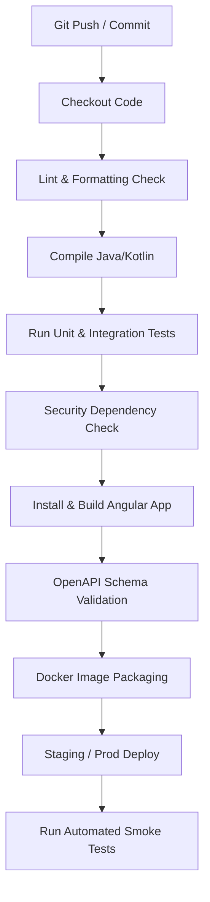

# CI/CD Automated Delivery Pipeline Strategy

This document details the CI/CD pipeline architecture, quality gates, test execution phases, artifact packaging, and automated deployment strategy for the MRO/CMMS platform.

---

## 1. Automated Pipeline Workflow

---

## 2. Pipeline Stages Detailed

### 2.1 Checkout & Code Verification
- **Code Linting**: Enforce Kotlin formatting rules using `ktlint` or `detekt` and Angular lints using `eslint`. Pipeline fails if there are formatting errors.

### 2.2 Compilation & Backend Testing
- **Command**: `./gradlew clean build -x test` to verify compilations.
- **Unit & Integration Tests**: Runs tests using `./gradlew test`.
  - Service tests and Testcontainers integrations must run successfully.
  - Failures instantly halt the pipeline.

### 2.3 Dependency Vulnerability Scanning
- **Tool**: OWASP Dependency Check or Trivy scanning backend dependencies and container base images.
- **Gate**: Pipeline fails if critical-severity CVEs are discovered.

### 2.4 Frontend Build & OpenAPI Validation
- **OpenAPI Schema Check**: Validate that generated yaml files (`openapi/*.yaml`) are syntactically sound and match the OpenAPI 3.0.3 specifications.
- **Angular Compilation**: Build the Angular bundle using `npm run build -- --configuration=production`.

### 2.5 Container Packaging & Publishing
- **Docker Build**: Build the production image using the Dockerfile inside `backend`.
- **Registry**: Tag the image with the Git commit SHA and publish to the company's secure Docker container registry.

### 2.6 Deployment & Verification
- **Deploy**: Trigger server updates via Ansible or Docker Compose configurations.
- **Automated Smoke Tests**: Perform quick HTTP checks on `/actuator/health` to confirm the container boots successfully and dependencies (PostgreSQL) are reachable.
