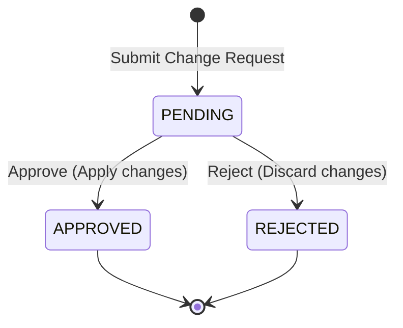

# Approval State Machine Lifecycle

This document describes the state machine transitions, operational invariants, and required permissions for **Change Requests** (Equipment creation/updates approval) in the Equipment Passportization System (EPS) module.

## State Transition Diagram

## State Definitions

| State | Description |
|---|---|
| **PENDING** | Change request has been submitted and is awaiting manager review. |
| **APPROVED** | Change request is approved. Changes are automatically committed/applied to the Equipment registry. Terminal state. |
| **REJECTED** | Change request is rejected. Proposed changes are discarded. Terminal state. |

## Allowed Transitions Matrix

| From \ To | PENDING | APPROVED | REJECTED |
|---|:---:|:---:|:---:|
| **PENDING** | - | Yes | Yes |
| **APPROVED** | No | - | No |
| **REJECTED** | No | No | - |

## Business Invariants & Rules

1. **Proposed Data Verification**:
   - For `CREATE` requests, the proposed data must be a valid JSON representation of a `CreateEquipmentRequest`.
   - For `UPDATE` requests, the proposed data must be a valid JSON representation of an `UpdateEquipmentRequest`, and a valid `entityId` referencing an existing equipment must be specified.
2. **Immutable State**: Once a change request is in `APPROVED` or `REJECTED` status, no further state transition or modification is allowed.
3. **Automated Application**:
   - Upon `APPROVED` transition for `CREATE` change request:
     - The equipment is created with `EquipmentStatus.ACTIVE`.
     - The generated `entityId` is updated in the change request.
   - Upon `APPROVED` transition for `UPDATE` change request:
     - The equipment is updated in the equipment registry.
4. **Audit Log Verification**: Every change request state transition logs an audit trail event showing who requested, approved, or rejected the change.

## Authorization Matrix

| Transition / Operation | Required Authority | Allowed Roles |
|---|---|---|
| **Submit Change Request** | `EPS_WRITE` | `SYSTEM_ADMIN`, `EPS_MANAGER` |
| **Approve Change Request** | `EPS_APPROVE` | `SYSTEM_ADMIN`, `EPS_MANAGER` |
| **Reject Change Request** | `EPS_APPROVE` | `SYSTEM_ADMIN`, `EPS_MANAGER` |
