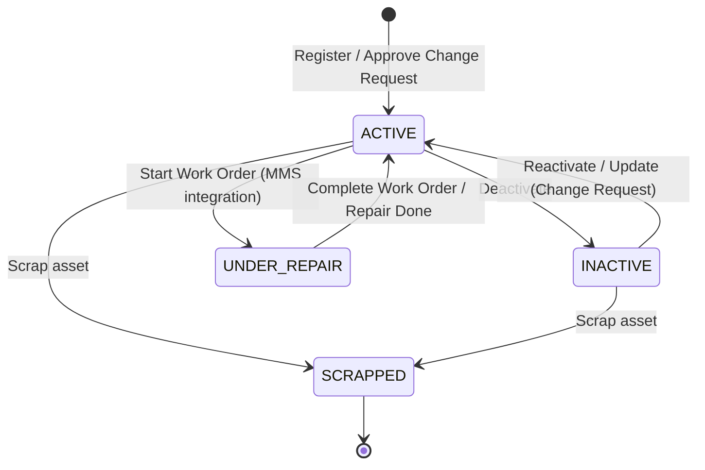

# Equipment Registry State Machine Lifecycle

This document describes the state machine transitions, operational invariants, and required permissions for **Equipment (Assets)** in the Equipment Passportization System (EPS) module.

## State Transition Diagram

## State Definitions

| State | Description |
|---|---|
| **ACTIVE** | The equipment is in operation, available for scheduling, preventive maintenance, and corrective actions. |
| **INACTIVE** | The equipment is temporarily out of service (e.g., mothballed or decommissioned). |
| **UNDER_REPAIR** | The equipment is undergoing corrective or scheduled maintenance work. |
| **SCRAPPED** | The equipment is permanently decommissioned, written off, and cannot be reactivated or used. Terminal state. |

## Allowed Transitions Matrix

| From \ To | ACTIVE | INACTIVE | UNDER_REPAIR | SCRAPPED |
|---|:---:|:---:|:---:|:---:|
| **ACTIVE** | - | Yes | Yes | Yes |
| **INACTIVE** | Yes | - | No | Yes |
| **UNDER_REPAIR**| Yes | No | - | No |
| **SCRAPPED** | No | No | No | - |

## Business Invariants & Rules

1. **Unique Asset Tag**: Registration requires a unique `assetTag`. Duplicate asset tags will trigger a `409 CONFLICT` exception.
2. **Deactivation**: Deactivating an asset does not delete it from the registry but changes its status to `INACTIVE`.
3. **Change Control**: Modifying core technical passports and deactivating/reactivating assets must be done through approved EPS Change Requests to ensure strict configuration control.
4. **Maintenance Synchronization**: Active PM Schedules generate corrective work orders only for equipment in `ACTIVE` or `UNDER_REPAIR` states.

## Authorization Matrix

| Transition / Operation | Required Authority | Allowed Roles |
|---|---|---|
| **Register Equipment** | `EPS_WRITE` | `SYSTEM_ADMIN`, `EPS_MANAGER` |
| **Update Technical Passport**| `EPS_WRITE` | `SYSTEM_ADMIN`, `EPS_MANAGER` |
| **Deactivate Equipment** | `EPS_WRITE` | `SYSTEM_ADMIN`, `EPS_MANAGER` |
| **Reactivate Equipment** | `EPS_WRITE` | `SYSTEM_ADMIN`, `EPS_MANAGER` |
| **Scrap Equipment** | `EPS_WRITE` | `SYSTEM_ADMIN`, `EPS_MANAGER` |
