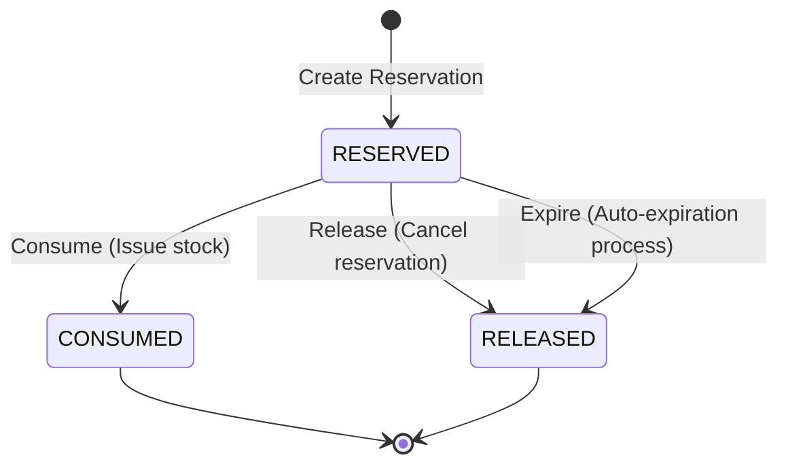

# Reservation State Machine Lifecycle

This document describes the state machine transitions, operational invariants, and required permissions for **Reservations** in the Warehouse Management System (WMS) module.

## State Transition Diagram

## State Definitions

| State | Description |
|---|---|
| **RESERVED** | Quantity of a part is locked in a warehouse for a reference (e.g., Work Order). It cannot be sold or issued elsewhere. |
| **RELEASED** | The lock is released, and the quantity becomes available for general stock again. Terminal state. |
| **CONSUMED** | The reserved quantity has been issued and removed from inventory (e.g., used in a Work Order). Terminal state. |

## Allowed Transitions Matrix

| From \ To | RESERVED | RELEASED | CONSUMED |
|---|:---:|:---:|:---:|
| **RESERVED** | - | Yes | Yes |
| **RELEASED** | No | - | No |
| **CONSUMED** | No | No | - |

## Business Invariants & Rules

1. **Available Stock Validation**: A reservation can only be created if the `quantityAvailable` (i.e. `quantityOnHand - quantityReserved`) is greater than or equal to the requested reservation `quantity`.
2. **Double Lock Prevention**: Stock level available quantity calculation:
   $$\text{Quantity Available} = \text{Quantity On Hand} - \text{Quantity Reserved}$$
3. **Reservation Consuming**: Consuming a reservation:
   - Decreases `quantityOnHand` by the reserved quantity.
   - Decreases `quantityReserved` by the reserved quantity.
   - Transitions reservation status to `CONSUMED`.
   - Records a `StockMovement` of type `ISSUE`.
4. **Reservation Releasing**: Releasing a reservation:
   - Decreases `quantityReserved` by the reserved quantity (making it available in stock again).
   - Transitions reservation status to `RELEASED`.
5. **Auto-Expiration**: Active reservations with an `expiresAt` timestamp in the past are automatically transitioned to `RELEASED` by a scheduled process (`POST /wms/reservations/expire`).

## Authorization Matrix

| Transition / Operation | Required Authority | Allowed Roles |
|---|---|---|
| **Create Reservation** | `WMS_RESERVE` | `SYSTEM_ADMIN`, `WMS_MANAGER`, `MMS_MANAGER`, `MMS_TECHNICIAN` |
| **Release Reservation** | `WMS_RESERVE` | `SYSTEM_ADMIN`, `WMS_MANAGER`, `MMS_MANAGER`, `MMS_TECHNICIAN` |
| **Consume Reservation** | `WMS_CONSUME` | `SYSTEM_ADMIN`, `WMS_MANAGER`, `WAREHOUSE_CUSTODIAN` |
| **Expire Reservations** | `WMS_RESERVE` | Scheduled system task / `SYSTEM_ADMIN` |
