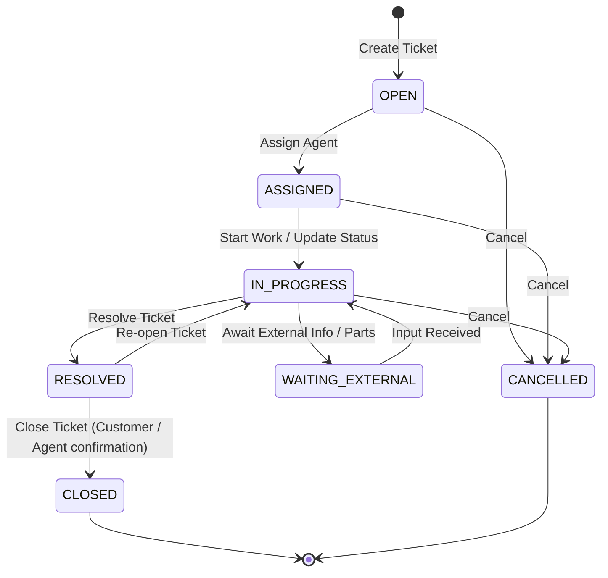

# Ticket State Machine Lifecycle

This document describes the state machine transitions, operational invariants, and required permissions for **Tickets** in the Service Request System (SRS) module.

## State Transition Diagram

## State Definitions

| State | Description |
|---|---|
| **OPEN** | Ticket created by requester. No agent is assigned yet. |
| **ASSIGNED** | Assigned to an agent or specialist for triage. |
| **IN_PROGRESS** | The agent is actively investigating, fixing, or coordinating resolution of the ticket. |
| **WAITING_EXTERNAL**| Paused while waiting for a response, confirmation, or action from the requester, a vendor, or third party. |
| **RESOLVED** | The agent has implemented a fix or solution and marked the ticket as resolved. |
| **CLOSED** | The requester or agent has verified the resolution and permanently closed the ticket. Terminal state. |
| **CANCELLED** | The ticket was cancelled (e.g., duplicate or invalid request). Terminal state. |

## Allowed Transitions Matrix

| From \ To | OPEN | ASSIGNED | IN_PROGRESS | WAITING_EXTERNAL | RESOLVED | CLOSED | CANCELLED |
|---|:---:|:---:|:---:|:---:|:---:|:---:|:---:|
| **OPEN** | - | Yes | No | No | No | No | Yes |
| **ASSIGNED** | No | - | Yes | No | No | No | Yes |
| **IN_PROGRESS** | No | No | - | Yes | Yes | No | Yes |
| **WAITING_EXTERNAL**| No | No | Yes | - | No | No | No |
| **RESOLVED** | No | No | Yes | No | - | Yes | No |
| **CLOSED** | No | No | No | No | No | - | No |
| **CANCELLED** | No | No | No | No | No | No | - |

## Business Invariants & Rules

1. **Equipment Reference**: Creating corrective work orders from a ticket requires that the ticket references a valid `equipmentId`.
2. **Work Order Integration**: When a work order is generated from a ticket, a bidirectional reference is established (linked via `linkedWorkOrderId` on the ticket).
3. **Internal Comments Visibility**: Comments marked as `isInternal = true` are only visible to users with agent permissions (`SRS_ASSIGN`, `SRS_RESOLVE`, or `SRS_WRITE`) and hidden from standard reuqesters.
4. **SLA Calculation**: Default SLA time (in hours) is configured on the `RequestType`. Resolution times are monitored relative to `openedAt` and `dueAt`.

## Authorization Matrix

| Transition / Operation | Required Authority | Allowed Roles |
|---|---|---|
| **Create Ticket** | `SRS_WRITE` | `SYSTEM_ADMIN`, `SRS_MANAGER`, `SRS_AGENT`, Requester roles |
| **Assign Ticket** | `SRS_ASSIGN` | `SYSTEM_ADMIN`, `SRS_MANAGER` |
| **Change Status (Resolve/Close)** | `SRS_RESOLVE` | `SYSTEM_ADMIN`, `SRS_MANAGER`, `SRS_AGENT` |
| **Add Comment** | `SRS_WRITE` | Any authenticated user |
| **Add Attachment** | `SRS_WRITE` | Any authenticated user |
| **Create Linked Work Order** | `SRS_WRITE` | `SYSTEM_ADMIN`, `SRS_MANAGER`, `SRS_AGENT` |
