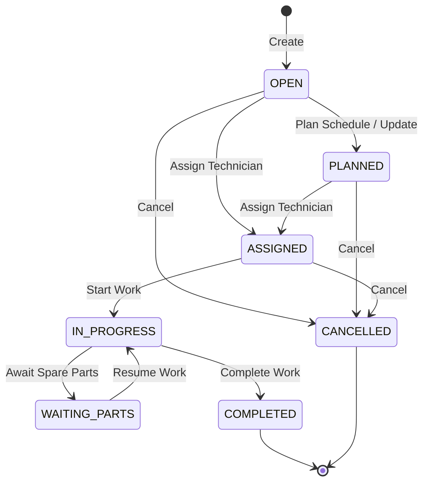

# Work Order State Machine Lifecycle

This document describes the state machine transitions, operational invariants, and required permissions for **Work Orders** in the Maintenance Management System (MMS) module.

## State Transition Diagram

## State Definitions

| State | Description |
|---|---|
| **OPEN** | Work order created but not scheduled or assigned. |
| **PLANNED** | Scheduled with a specific plan/date, but not yet assigned to a technician. |
| **ASSIGNED** | A technician has been assigned to execute the work order. |
| **IN_PROGRESS** | Work execution has started and is currently ongoing. |
| **WAITING_PARTS** | Execution is paused due to parts shortage or pending warehouse release. |
| **COMPLETED** | Work has been successfully executed, checklist tasks signed off, and completion act registered. Terminal state. |
| **CANCELLED** | Work order cancelled before completion. Terminal state. |

## Allowed Transitions Matrix

| From \ To | OPEN | PLANNED | ASSIGNED | IN_PROGRESS | WAITING_PARTS | COMPLETED | CANCELLED |
|---|:---:|:---:|:---:|:---:|:---:|:---:|:---:|
| **OPEN** | - | Yes | Yes | No | No | No | Yes |
| **PLANNED** | No | - | Yes | No | No | No | Yes |
| **ASSIGNED** | No | No | - | Yes | No | No | Yes |
| **IN_PROGRESS** | No | No | No | - | Yes | Yes | No |
| **WAITING_PARTS**| No | No | No | Yes | - | No | No |
| **COMPLETED** | No | No | No | No | No | - | No |
| **CANCELLED** | No | No | No | No | No | No | - |

## Business Invariants & Rules

1. **Checklist Task Auto-Completion**: Completing a work order automatically transitions all remaining `OPEN` checklist tasks to `COMPLETED`.
2. **Technician Assignment**: Transition to `ASSIGNED` requires a valid `technicianId` to be provided in the payload.
3. **Completion Act Validation**: Transition to `COMPLETED` requires a non-blank `completionAct` JSON payload representing the task completions. A SHA-256 hash of this payload is computed and saved as a `signatureHash` to guarantee integrity.
4. **Integration with SRS**: Work orders created from service tickets (corrective maintenance) inherit properties and link back to the originating ticket via `linkedWorkOrderId`.

## Authorization Matrix

| Transition / Operation | Required Authority | Allowed Roles |
|---|---|---|
| **Create Work Order** | `MMS_WRITE` | `SYSTEM_ADMIN`, `MMS_MANAGER` |
| **Assign Work Order** | `MMS_ASSIGN` | `SYSTEM_ADMIN`, `MMS_MANAGER` |
| **Start Work Order** | `MMS_START` | `SYSTEM_ADMIN`, `MMS_MANAGER`, `MMS_TECHNICIAN` |
| **Complete Work Order**| `MMS_COMPLETE` | `SYSTEM_ADMIN`, `MMS_MANAGER`, `MMS_TECHNICIAN` |
| **Cancel Work Order** | `MMS_CANCEL` | `SYSTEM_ADMIN`, `MMS_MANAGER` |
| **Add Checklist Task** | `MMS_WRITE` | `SYSTEM_ADMIN`, `MMS_MANAGER` |
| **Complete Task** | `MMS_COMPLETE` | `SYSTEM_ADMIN`, `MMS_MANAGER`, `MMS_TECHNICIAN` |
